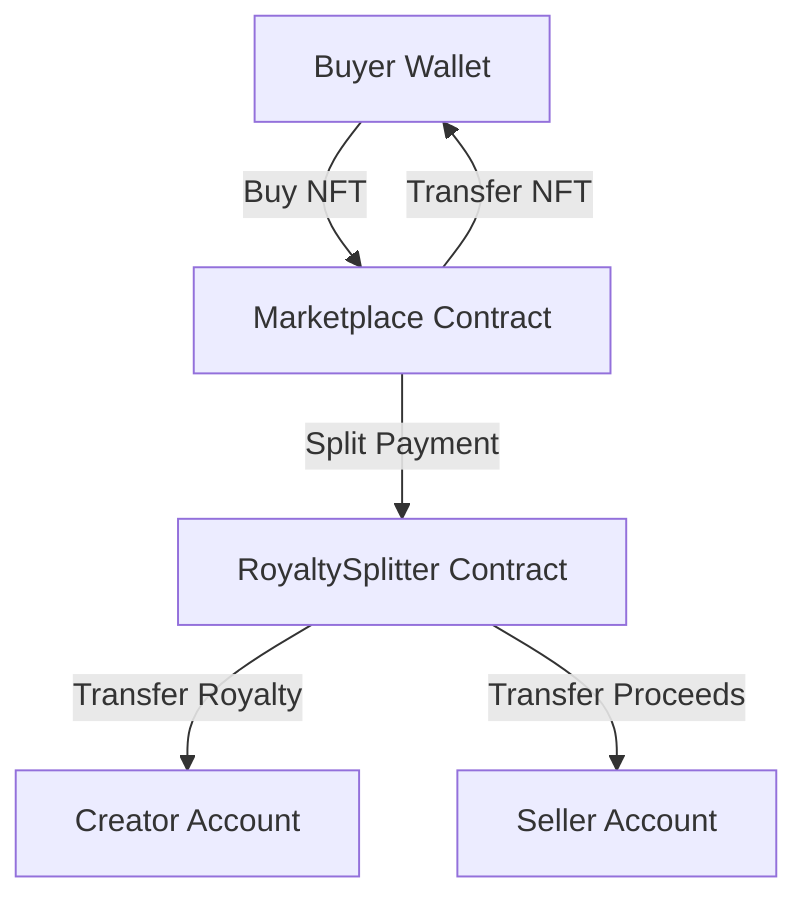

# NFT Royalty Marketplace on Stellar

A production-ready NFT marketplace built on the Stellar network using Soroban smart contracts. Features include atomic inter-contract calls for automated royalty distribution and a real-time sales feed using Horizon SSE.

## Features
- **Atomic Royalty Distribution**: The Marketplace contract calls the RoyaltySplitter contract to distribute funds in a single transaction.
- **STARTNFT Collection**: Custom NFT collection minted on Testnet.
- **Real-time Sales Feed**: Live updates on recent purchases using Stellar Horizon SSE.
- **Mobile Responsive**: Fully optimized for a 375px viewport with Tailwind CSS.
- **CI/CD**: GitHub Actions for testing and linting, with automated Vercel deployment.

## Live Demo
[Live Demo Link (Vercel)](https://nft-royalty-marketplace.vercel.app)

## Deployed Contracts (Testnet)
- **Marketplace**: `CCIGXUYLGJWZK3RZ7SMQD6RXGECU2X56AQTDUCXQH7S5PXKXCYEUWWWL`
- **Royalty Splitter**: `CBGS3HWQ7JOH3MMLXY64ACEQHIY6XLD35EURXMTLILNCDURJBMAFV5ZA`
- **STARTNFT Asset**: `CDP7NE5WFWA6U3Q6LFMZPQR2GVR5LTSELQGFBMBUDHVZPJRHUZSA7VCI`

## Transaction Hashes
- **Marketplace Deploy**: `fb501ed7cb89a6e3c0e2f0e6e2a81c062b57c27da7fd61aad6dd90535688e08f`
- **Splitter Deploy**: `c29c6f64990929076721e172d5e0d5e76630c2dcb0ec0697658df50c227122bf`
- **STARTNFT Deploy**: `196255819e6ab6e8d1e00ba64b56eaefcebfa9f576c4216479de92f978f5c9aa`

## CI/CD Status

## Mobile View

## Technical Architecture

